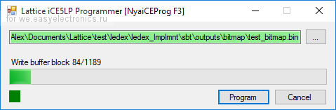
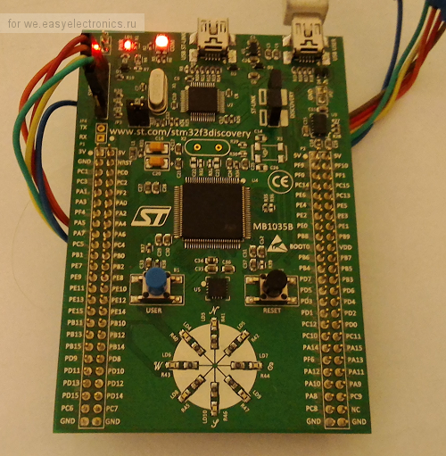
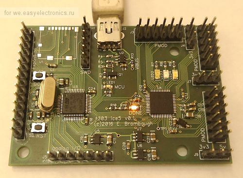

# Programmer tool for Lattice iCE5 (iCE40 Ultra) FPGA

USB Custom HID interface.
FPGA bitstream is uploaded to FPGA SRAM!

## Supported hardware
1. STM32F3Discovery

[Firmware](firmware/stm32f303/stm32f3lattice_disc.hex)

Pinout:
| Pin | Func  | 
|-----|-------|
| PA5 | SCK   | 
| PA7 | MOSI  |
| PB0 | CS    |
| PB1 | CRST  |
| PB2 | CDONE |
| PE8 | LED   |

2. [STM32F303 + ice5 Development Board](http://ebrombaugh.studionebula.com/embedded/f303_ice5/)

[Firmware](firmware/stm32f303/stm32f3lattice_ice5.hex)

Pinout:
| Pin | Func  | 
|-----|-------|
| PA5 | SCK   | 
| PA7 | MOSI  |
| PB0 | CS    |
| PB1 | CRST  |
| PB2 | CDONE |
| PA9 | LED   |

## Loading algo for iCE40
1. CS set low.
2. CRST set low.
3. Wait CDONE goes low.
4. CRST set high.
5. Wait some time (FPGA loading).
6. Send bitstream via SPI (8 bits MSP, Mode=0), ~70 kbytes, 80 bytes header included.
7. Periodically send 0xFF and wait CDONE goes high.
8. After CDONE goes high send 49 clock pulses (7 bytes) and set CS high.
